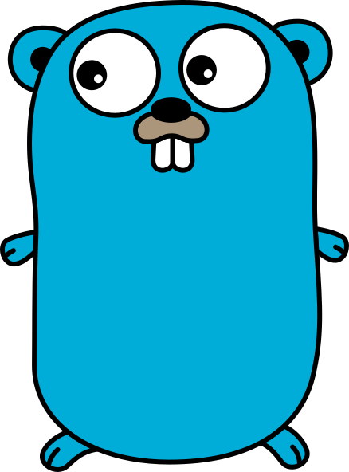

# Olá, eu sou o [Davi Peterson](https://davi-peterson.vercel.app/pt)

Desenvolvedor de software com foco em **Next.js** e **Go**, graduando no 4º período de Análise e Desenvolvimento de Sistemas pela UniNorte e fundador da [SyncForge](https://syncforge-business.vercel.app/).

Desenvolvo aplicações web e produtos digitais, atuando em projetos próprios e soluções para empresas.

## Tecnologias

  
  &nbsp;&nbsp;&nbsp;
  

## Sobre mim

Atuo em diferentes camadas do desenvolvimento de software, trabalhando com interfaces, experiência do usuário, APIs, persistência de dados, cache, filas, integrações e processamento assíncrono.

Tenho experiência com code review e já assumi responsabilidades de liderança técnica tanto no frontend quanto no backend. Já contribuí com decisões de arquitetura, definição de padrões, organização de demandas e apoio técnico aos desenvolvedores durante a construção das soluções.

Atualmente, tenho aprofundado meus estudos em arquitetura de software, com foco em DDD, monólitos modulares, microsserviços e arquitetura orientada a eventos.

## Contato

* E-mail: **[davipetersondev173@gmail.com](mailto:davipetersondev173@gmail.com)**
* LinkedIn: [linkedin.com/in/davipeterson](https://www.linkedin.com/in/davipeterson/)
* Portfólio: [davi-peterson.vercel.app](https://davi-peterson.vercel.app)
* SyncForge: [syncforge-business.vercel.app](https://syncforge-business.vercel.app/)

---

  

